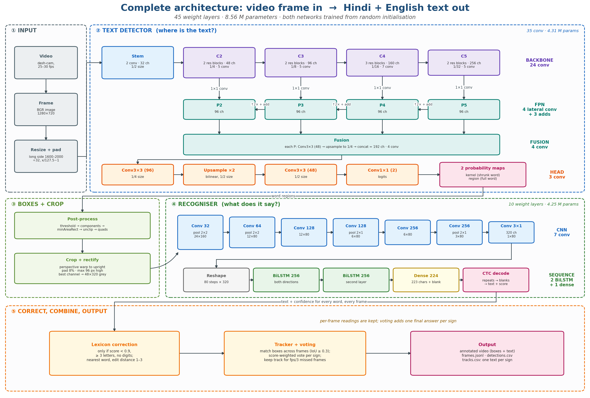

# Bilingual Scene Text Detection and Recognition for Dashcam Video

Finds and reads **Hindi (Devanagari) and English** text in dash-camera video — highway boards, shop
fascias, warning signs, milestones and number plates. Both networks are trained **from random
initialisation**; no pretrained weights are used anywhere in this project.



## What it does

A video frame goes in, and for every word the system returns a quadrilateral, the text, and a
confidence score. Across frames, an IoU tracker groups the detections of the same sign and a
score-weighted vote produces one final reading per sign — which repairs a large share of single-frame
mistakes.

| Stage | What happens |
|---|---|
| Detector | segmentation network predicts a text-kernel map and a text-region map at 1/2 resolution |
| Post-processing | threshold → connected components → minimum-area rectangle → unclip → word quadrilaterals |
| Rectification | perspective warp to an upright crop (8% padding, at most 96 px high) |
| Recogniser | CRNN + CTC on a 48×320 grey crop, 223 characters (Latin + Devanagari) plus blank |
| Lexicon | nearest-word correction, applied only to readings with confidence below 0.9 |
| Tracking | IoU matching across frames, score-weighted voting, one reading per sign |

Two design choices are specific to Devanagari: the recogniser input is 48 px tall (not the usual 32)
so vowel signs above and below the headline survive, and labels are stored in **visual order** — the
pre-base vowel sign *i* is moved before its consonant cluster for training and moved back after
decoding.

| Model | Parameters | Layers |
|---|---|---|
| Detector | 4,309,954 | 35 convolutional (24 backbone, 8 FPN, 3 head) |
| Recogniser | 4,246,656 | 7 convolutional, 2 BiLSTM, 1 dense |

## Results

All numbers are on held-out data that the models never saw during training. "Found" means the
detector's box overlaps the ground-truth box with IoU ≥ 0.5; "found + read" additionally requires the
text to match.

| Test set | Found | Found + read |
|---|---|---|
| Real dash-camera video — RoadText-1K, 30 clips, 293 text instances | 45.1% | 34.8% |
| Real photos — BSTD test split, signs at least 32 px tall | 75.4% | 53.2% |
| Real photos — BSTD test split, all words | 32.3% | 22.2% |
| Generated dash-camera clip, 63 text instances | 95.2% | 85.7% |

Reading only (ground-truth boxes, so detector errors are excluded), BSTD test crops: **Hindi 47.0%**,
**English 56.1%**.

Two observations worth keeping in mind:

- **Voting matters.** On the generated clip, single frames were read correctly 58.7% of the time; the
  track vote raised that to 85.7%.
- **Small text is where the misses are.** On BSTD, words under 16 px tall are found only 7.1% of the
  time, and half of the test words fall in that group — which is why the "all words" row is far below
  the "at least 32 px" row.

## Training data

| Source | Use | Licence |
|---|---|---|
| Synthetic road scenes (generated by this repo) | phase 1, and 20–40% of every later batch | — |
| [Bharat Scene Text Dataset](https://github.com/Bhashini-IITJ/BharatSceneTextDataset) (IIT Jodhpur) | phase 2 training and the main evaluation | Apache-2.0 |
| [darknight054/indic-mozhi-ocr](https://huggingface.co/datasets/darknight054/indic-mozhi-ocr) | optional recogniser fine-tuning (Hindi word crops) | see dataset card |
| [RoadText-1K](https://cvit.iiit.ac.in/research/projects/cvit-projects/roadtext-1k) (IIIT Hyderabad) | video evaluation only, never training | see dataset page |
| [Google Fonts](https://github.com/google/fonts) — 90 families, 71 with Devanagari | rendering synthetic text | OFL / Apache-2.0 |

The synthetic generator draws what is *not* text as well — lane markings, zebra crossings, windows,
shutters, poles, wires, vehicles — so that the detector learns to reject them.

## Repository layout

```
notebooks/road_text_ocr.ipynb   the whole pipeline, top to bottom (start here)
src/                            the same code as numbered scripts, in notebook order
docs/                           architecture diagrams and a detailed architecture PDF
requirements.txt                tested package versions
```

`src/` mirrors the notebook sections one-to-one. The files share one namespace and are meant to run in
order (01 → 23); the notebook is the entry point.

## How to run

**On Kaggle** (what this was developed on):

1. Upload `notebooks/road_text_ocr.ipynb`. In Settings choose **GPU T4 x2** and **Internet On**.
2. Set `QUICK_RUN = True` in section 5 and run everything. This takes a few minutes, needs no dataset
   download, and only checks that every cell runs — its accuracy numbers mean nothing.
3. Set `QUICK_RUN = False` and run again for the real training (roughly 4–5 hours: phase 1 ~1 h,
   dataset ~25 min, phase 2 ~2.5 h, evaluation ~20 min).
4. Attach the BSTD detection split as a Kaggle dataset to skip the download in section 15.

Interrupted training resumes from the last epoch, and a finished model is loaded instead of retrained
(pass `retrain=True` to force training again).

**Locally**: `pip install -r requirements.txt`, plus FFmpeg, `libfribidi0`, `libraqm0` and a Devanagari
font. Without RAQM, Pillow cannot shape Hindi text and the synthetic renderer will fail.

## Limitations

- Hindi and English only. Other Indic scripts in BSTD are detected but not read, and they are excluded
  from the scores rather than counted as errors.
- Small and distant text is the main weakness (7.1% found under 16 px).
- Night footage is the hardest case; on night dash-camera clips only large, bright boards are read
  reliably.
- The generated-clip numbers are far higher than the real-video numbers because the model was trained
  on scenes from the same generator. Treat them as an upper bound, not as performance in the field.

## Licence

Code in this repository: MIT (see `LICENSE`). Datasets and fonts keep their own licences, listed above.
